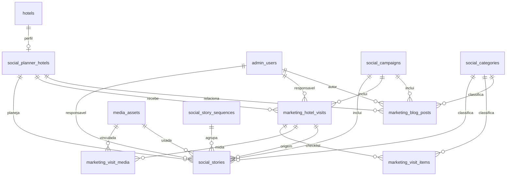

# Fioreze Marketing Planner — passagem de contexto para outro Codex

**Atualizado em:** 2026-10-02

**Repositório:** `sistemas-fioreze/ecossistema-fioreze`

**Ambiente autorizado:** desenvolvimento Cloudflare

**Estado deste documento:** descrição do código e das verificações realizadas; limitações são indicadas explicitamente.

## 1. Leia isto primeiro

O Marketing Planner já existe no repositório e no ambiente **dev**. Ele reúne planejamento de Stories para seis perfis de Instagram, agenda de captação nos hotéis, planejamento editorial do Blog, campanhas e uma visão geral operacional. A aplicação usa o login administrativo e o banco D1 existentes. **Não recrie o projeto em outra stack, não substitua o Worker ativo e não crie uma segunda base de usuários.**

Antes de alterar ou publicar:

1. Leia este documento, [`production-reconciliation-2026-10-02.md`](production-reconciliation-2026-10-02.md), as migrations `0059` e `0060` e os arquivos de rotas/repositórios indicados abaixo.
2. Atualize `main` e examine o diff e o histórico recente. O Worker/Pages publicados em 2026-09-23 continham código que não estava no GitHub; a conciliação foi feita e mesclada, mas faltam os **SQLs originais das migrations de dados 0052–0055 e 0058**.
3. Preserve os módulos públicos e administrativos preexistentes. Teste o Planner e regressões dos portais antes de novo deploy.
4. Use apenas o ambiente **dev configurado** para deploy, conforme autorização do usuário. Não use produção por inferência. Não invente credenciais nem coloque secrets no browser.

## 2. Links e estado conhecido

| Item | Referência |
| --- | --- |
| Código | <https://github.com/sistemas-fioreze/ecossistema-fioreze> |
| Entrada solicitada | <https://portal.hoteisfioreze.com.br/socialplanner> |
| Rota interna | `/admin/social-planner/overview` |
| API privada | `/api/v1/admin/social-planner` |
| PR principal, com conciliação | <https://github.com/sistemas-fioreze/ecossistema-fioreze/pull/257> |
| PR de retorno ao Planner após login | <https://github.com/sistemas-fioreze/ecossistema-fioreze/pull/258> |

Em 2026-10-02, os PRs 257 e 258 estavam mesclados em `main`. O deploy de desenvolvimento do PR 258 concluiu no GitHub Actions (run `37016350577`): Worker `fioreze-portais-dev`, versão `034aa4c4-db14-41ff-9326-7c73f6edf9f7`, e Pages `fioreze-portais-pages-dev`, deployment `cb6b7e53-dfd6-45ac-bf67-ae36a6d5c209`. Estes IDs são um **registro histórico**, não prova de que o ambiente continua igual: confira novamente antes de mexer no deploy.

O atalho `/socialplanner` respondeu com redirecionamento 308 para a rota interna, preservando a query string. Sem sessão, a página envia para `/admin/?next=...`; após login o admin aceita apenas um retorno ao Planner na mesma origem. A API privada respondeu 401 sem autenticação, como esperado. **A operação autenticada completa no navegador não foi verificada**, pois não havia uma sessão administrativa disponível para o teste.

## 3. Stack e integração existente

| Camada | Implementação |
| --- | --- |
| Backend | Cloudflare Worker em JavaScript ESM, rotas próprias em `app/src` |
| Hospedagem web | Cloudflare Pages com `_worker.js` gerado a partir do backend; domínio customizado `portal.hoteisfioreze.com.br` |
| Dados | Cloudflare D1 / SQLite; migrations em `app/migrations` |
| Mídia | Biblioteca `media_assets` e Cloudflare R2 já existentes; Planner referencia IDs de assets |
| Frontend | TypeScript sem React, HTML/CSS e esbuild; bundle gerado em `app/public/js/modules/social-planner/planner.js` |
| Autenticação | Sessão e permissões do admin existente (`admin_users`, roles e middleware compartilhados) |
| Ícones | SVGs na UI e dependência `lucide` disponível no projeto |

Configurações: `app/wrangler.jsonc` (Worker), `app/pages/wrangler.jsonc` (Pages), `app/package.json`. Os bindings usados em dev apontam para D1 `fioreze-portais-db-dev` (identificador mantido exclusivamente nas configurações Wrangler) e R2 `fioreze-portais-media-dev`. **Nunca acesse D1 do browser.** A UI chama a API privada com cookie de mesma origem e a proteção de mutação administrativa existente.

O deploy principal está em `.github/workflows/deploy-cloudflare-worker-pages.yml`; ele executa validações, publica Worker e Pages ao alterar caminhos de código/configuração previstos no workflow. Uma alteração apenas em `app/docs` não dispara esse deploy. Houve também workflow de preview para a branch histórica `codex/fioreze-social-planner`, que publicava uma versão de Worker sob o alias `marketing-planner` sem mover tráfego ativo.

## 4. Mapa de arquivos

| Caminho | Responsabilidade |
| --- | --- |
| `app/src/index.js` | Registra rotas, redireciona `/socialplanner`, resolve asset da área admin |
| `app/src/modules/social-planner/routes.js` | Endpoints e checagem de sessão/permissões |
| `app/src/modules/social-planner/repository.js` | Hotéis, categorias, usuários, campanhas, Stories e sequências no D1 |
| `app/src/modules/social-planner/marketing-repository.js` | Visitas, checklist, mídia vinculada, Blog e configuração no D1 |
| `app/social-planner/types.ts` | Tipos compartilhados do frontend |
| `app/social-planner/repository.ts` | Contrato `StoryRepository` e implementação HTTP `apiStoryRepository` |
| `app/social-planner/marketing-repository.ts` | Cliente HTTP de visitas, Blog e configuração |
| `app/social-planner/app.ts` | Estado de URL, navegação, semana/calendário de Stories, drawers e eventos |
| `app/social-planner/visits.ts` | Visões de visitas e formulário do drawer |
| `app/social-planner/blog.ts` | Cronograma, Kanban e formulário editorial |
| `app/social-planner/overview.ts` | Indicadores e próximas ações determinísticas |
| `app/social-planner/marketing-ui.ts`, `utils.ts` | Campos, rótulos, datas e escape de HTML |
| `app/public/admin/social-planner/index.html` | Shell da aplicação |
| `app/public/css/modules/social-planner/planner.css` | Layout e responsividade |
| `app/scripts/build-social-planner.js` | Compila TypeScript para o bundle público |
| `app/migrations/0059_social_planner.sql` | Dados e tabelas de Stories, campanhas, categorias e permissões |
| `app/migrations/0060_marketing_planner.sql` | Visitas, checklist, Blog, configuração e elo Story–visita |
| `app/public/js/modules/admin/admin.js` | Link do Planner condicionado à permissão e retorno pós-login |

## 5. Dados compartilhados



- `hotels` é o cadastro compartilhado preexistente. `social_planner_hotels` acrescenta nome de exibição, usuário do Instagram, ordenação e ativação; os seis hotéis são **seed de dados**, não array fixo na UI: Hotéis Fioreze, Quero Quero, Müller & Fioreze, Origem, Primo e Chalés Família Fioreze.
- `admin_users` é a fonte de responsáveis e autores. O Planner não mantém usuários paralelos.
- `social_categories` é um catálogo próprio do Planner, usado por Stories, checklist e Blog. Há 15 categorias iniciais na migration 0059. **Ainda não há CRUD administrativo de categorias na UI**; a página atual apenas lista.
- `social_campaigns` conecta os três domínios; sua listagem agrega contagens de Stories, publicados, visitas, artigos e hotéis. Não duplique campanha por módulo.
- `media_assets` é a biblioteca já existente. Um Story usa `media_asset_id`; uma visita pode associar vários arquivos por `marketing_visit_media`; um mesmo arquivo pode ser reutilizado.
- `social_stories.source_visit_id` liga a origem da captação. A sequência usa `sequence_group_id` e `sequence_position`; a ordenação dos cards usa também `sort_order`.
- `marketing_planner_settings.display_name` permite mudar o nome exibido sem alterar o código.

Os estados internos ficam em inglês; a UI tem labels em português. Story: `idea`, `to_produce`, `producing`, `approval`, `ready`, `scheduled`, `published`, `cancelled`. Visita: `planned`, `confirmed`, `in_progress`, `completed`, `cancelled`. Blog: `idea`, `briefing`, `writing`, `review`, `ready`, `scheduled`, `published`, `archived`.

## 6. API atual

Base: `/api/v1/admin/social-planner`. Todas as rotas exigem sessão administrativa. Leitura requer `social-planner.read`; mutação requer `social-planner.write` e `assertAdminMutationAllowed`. Respostas usam o envelope comum `ok`/`data`. O cliente adiciona `x-fioreze-admin-action: erp-admin` nas mutações, conforme padrão existente.

| Recurso | Endpoints |
| --- | --- |
| Referências | `GET /hotels`, `/categories`, `/pillars`, `/users` |
| Campanhas | `GET /campaigns`, `POST /campaigns`, `PATCH /campaigns/:id` |
| Sequências | `GET /sequences`, `POST /sequences`, `PATCH /sequences/:id/move`, `POST /sequences/:id/duplicate` |
| Stories | `GET /stories`, `GET /stories/:id`, `POST /stories`, `PATCH /stories/:id`, `DELETE /stories/:id` |
| Configuração | `GET /settings`, `PATCH /settings` |
| Visitas | `GET /visits`, `GET /visits/:id`, `POST /visits`, `PATCH /visits/:id`, `DELETE /visits/:id` |
| Checklist | `POST /visits/:id/items`, `PATCH /visits/:id/items/:itemId`, `DELETE /visits/:id/items/:itemId` |
| Mídia de visita | `POST /visits/:id/media`, `DELETE /visits/:id/media/:mediaId` |
| Blog | `GET /blog-posts`, `GET /blog-posts/:id`, `POST /blog-posts`, `PATCH /blog-posts/:id`, `DELETE /blog-posts/:id` |

`GET /stories` e `GET /visits` recebem `start_date`/`end_date` para buscar um intervalo, além de filtros de domínio. Stories aceitam `hotel_id`, `status`, `category_id`, `responsible_user_id`, `campaign_id`; visitas aceitam filtros como hotel, status, responsável e campanha; Blog aceita os filtros correspondentes. Confirme limites e semântica exata nos métodos `listStories`, `listVisits` e `listPosts` antes de mudar contrato. A pesquisa textual de Stories é feita no frontend. Os repositórios de backend validam campos, estados, datas, URLs, referências e usam parâmetros nas consultas D1.

## 7. Interface e fluxos implementados

### Entrada, navegação e URL

A sidebar mostra Visão Geral; Redes Sociais (Semana, Calendário, Pendências); Agenda de Hotéis (Semana, Calendário, Histórico); Blog (Cronograma, Pautas, Publicados); Conteúdo (Banco de conteúdos, Campanhas); Análise (Desempenho); Administração (Hotéis, Categorias, Usuários, Configurações). Usuários abre a administração central. A sidebar pode ser recolhida; a interface é desktop-first e possui layout adaptado para mobile.

O caminho da view é `/admin/social-planner/<view>`. A query preserva `week`, `day`, filtros de Stories (`hotel`, `status`, `category`, `responsible`, `campaign`, `q`), `visit_hotel` e filtros de Blog (`blog_hotel`, `blog_status`, `blog_category`, `blog_author`, `blog_campaign`). `app.ts` escolhe o intervalo conforme a view; `loadVersion` impede que uma resposta antiga sobrescreva uma navegação recente. Não há cache persistente no frontend.

### Redes Sociais

- Semana: matriz hotel × segunda–domingo, cabeçalhos/coluna de hotéis sticky, cards compactos com horário, estado, título, formato, categoria, responsável e miniatura quando existe. No celular vira seletor de dia e lista por hotel.
- Filtros, busca, indicadores da semana e alertas simples de lacuna, ideia para hoje, falta de responsável/mídia e volume alto.
- Criar/editar no drawer lateral; título, hotel e data são a base obrigatória. Contém planejamento, texto, CTA, campanha, mídia, visita de origem, publicação e observações.
- Drag-and-drop move Story entre dia/hotel, reordena e atualiza de forma otimista. Falha de API restaura o estado anterior e mostra toast. Sequências podem ser criadas, movidas e duplicadas pela API; confira a interação exata em `app.ts` antes de estender.
- Calendário mensal, Pendências, duplicação, marcação de estado e exclusão com confirmação.

### Agenda de Hotéis

- Semana, calendário mensal e histórico; cartões exibem hotel, horário, responsável, objetivo e status.
- Drawer de visita com título, data, horas, hotel, responsável, campanha, prioridade, status, descrição e notas.
- Depois de salvar a visita, checklist editável e vínculo de IDs de mídia preexistente. O detalhe retornado pela API inclui itens, assets vinculados e Stories originados da visita.

### Blog

- Cronograma mensal em lista ou calendário; Pautas em Kanban com arrastar entre estados; Publicados em lista.
- Drawer editorial com título, slug, data, hotel, campanha, autor, categoria, status, SEO, briefing, resumo, notas e URL publicada. Inclui duplicar, arquivar e excluir.
- É um **planejador editorial**, não um CMS: não redige nem publica automaticamente no site.

### Visão geral e outros destinos

A home reúne Stories de hoje, próxima visita/tarefas, artigos próximos, totais desta semana e “Próximas ações”. As regras são determinísticas no frontend; não há IA. Campanhas são cadastradas/editadas com contagens dos três módulos. Banco de Conteúdos aponta à biblioteca de mídia existente em `/admin/portais/media/` e pede o ID do asset para vincular. Hotéis e Categorias são visualizações de leitura. Desempenho é uma tela preparatória: **não existe integração autorizada com dados do Instagram**. Configurações edita o nome de exibição.

## 8. Segurança e permissões

- A migration 0059 registra `social-planner.read` e `social-planner.write` e cria a role `marketing-planner-editor`, com ambas. A atribuição a pessoas deve ser checada no admin/D1 atual antes de ampliar acesso; não conceda permissão geral por suposição.
- API, D1 e R2 ficam no servidor. O frontend recebe apenas dados necessários à interface e referencia mídia existente por ID. Não copie token, binding, cookie ou segredo para arquivos públicos.
- O link do Planner no admin aparece apenas a quem tem permissão de leitura. O redirecionamento pós-login restringe `next` a um caminho do Planner na mesma origem.
- Há validações de payload e integridade referencial no backend; mudanças no modelo precisam de migration revisável e testes que cubram o contrato.

## 9. Como executar e verificar

Dentro de `app/`:

```powershell
npm ci
npm run social:build
npm run social:typecheck
npm run validate
npm run dev
```

`npm run validate` executa checagem de estrutura, TypeScript do Planner, lint do projeto, build/check de Pages, testes Node e validação de Wrangler. Para testar D1 local: `npm run db:migrate:local`. **Não aplique `db:reset:local` em ambiente remoto.** Para publicar, use o workflow existente e confirme os bindings do ambiente de desenvolvimento.

Na verificação final anterior, `npm run validate` passou, com **624 testes Node**, e as migrations 0056, 0057, 0059 e 0060 foram aplicadas a um D1 local novo. Foram conferidos em dev o redirecionamento do atalho, a proteção 401 da API privada e endpoints públicos dos hotéis `centro`/`muller` e pacotes românticos. A navegação autenticada dos três módulos e o uso real pela equipe **continuam exigindo teste em sessão autorizada**. Repita o build e os testes após qualquer alteração; esta contagem é histórica.

## 10. Conciliação Cloudflare e risco residual

Em 2026-09-23, Worker e Pages ativos tinham alterações não presentes no GitHub. O código publicado foi comparado com a branch do Planner e as diferenças funcionais observadas foram incorporadas no PR 257: guardas dos módulos públicos, cache/limites de APIs, galeria de pacotes românticos, número de pedido persistido, estado de impressão, faturamento e arquivos publicados de ERP/Room Service/portais. Os esquemas observados do D1 foram reconstituídos nas migrations `0056_order_display_numbers.sql` e `0057_muller_special_package_gallery.sql`.

**Pendente:** o D1 dev registra 0052, 0053, 0054, 0055 e 0058 como aplicadas, mas o SQL original dessas migrations de dados não foi recuperado. Não crie arquivos vazios com esses nomes nem presuma conteúdo. Existe também registro remoto para `0050_fioreze_centro_decoration_images.sql` e `0050_admin_passkeys.sql`, enquanto o repositório contém apenas este último. Isso afeta a reprodução exata de um ambiente do zero. Veja o documento de conciliação e investigue backup/histórico antes de fazer uma migration que dependa desses dados.

## 11. Trabalho recomendado ao próximo Codex

Ordem sugerida, preservando o que já funciona:

1. **Verificação autenticada no dev:** entrar com perfil que possua `social-planner.read/write` e percorrer os fluxos de Story, sequência, drag-and-drop, visita/checklist/mídia, Blog/Kanban, campanha e settings. Inspecionar console, rede, foco por teclado, tablet e mobile. Corrigir falhas concretas; não afirmar prontidão operacional só pelo build.
2. **Completar administração de dados compartilhados:** CRUD de hotéis/perfis, categorias e pilares se o usuário precisar administrá-los no Planner. Hoje hotéis/categorias são leitura e pilares não têm seed nem tela de gestão. Reutilizar as tabelas e as permissões existentes.
3. **Melhorar biblioteca de mídia:** seleção visual e pesquisa de `media_assets` dentro dos drawers, respeitando autorização/R2 existentes. Hoje o vínculo é pelo ID; não implementar upload fictício.
4. **Cobrir contratos do Planner com testes focados:** rotas/permissões, migrations, filtros de intervalo, mutações de Story/sequência/visita/Blog e rollback otimista. A suíte geral passa, mas não prova cada interação do Planner.
5. **Resolver histórico de migrations:** localizar backup ou reconstituir com evidência revisável 0052–0055/0058 e a discrepância de 0050 antes de criar outro ambiente ou aplicar mudanças dependentes. Não alterar retrospectivamente migrations já aplicadas.
6. **Depois, se solicitado:** métricas e publicação do Instagram via integração oficial autorizada, CMS do Blog ou tela completa de hotel. Nenhuma dessas integrações está pronta hoje.

## 12. Prompt curto de retomada

> Trabalhe no repositório `sistemas-fioreze/ecossistema-fioreze`, em `app/`. Leia `app/docs/fioreze-marketing-planner-handoff.md` e `app/docs/production-reconciliation-2026-10-02.md` antes de editar. O Fioreze Marketing Planner já foi implementado e publicado em dev no mesmo domínio em `/socialplanner`; preserve Worker, Pages, admin, D1, R2 e os portais existentes. Confirme o estado atual de `main` e do dev, execute `npm run validate`, faça teste autenticado dos três módulos e corrija problemas observados. Não invente as migrations de dados 0052–0055/0058 nem credenciais. Documente exatamente o que foi verificado e o que permanece pendente.
