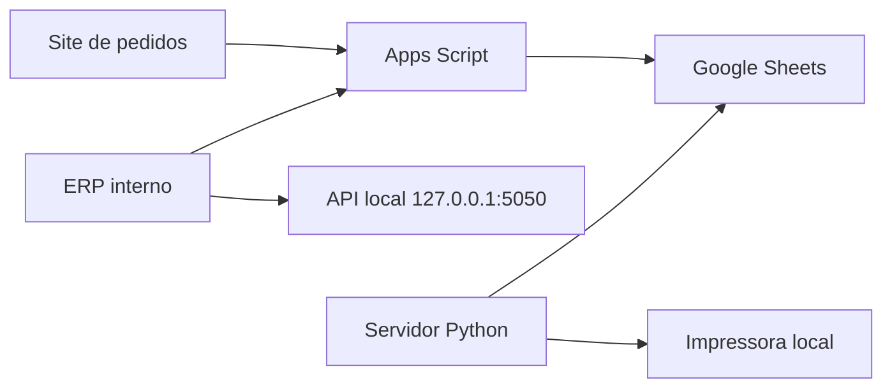

# Mapa do Sistema Muller & Fioreze

## Componentes

- Site publico de pedidos: HTML estatico legado em `room-service/pedidos`.
- ERP interno: HTML estatico legado em `room-service/erp`.
- Backend atual: Google Apps Script em `backend-appscript`.
- Dados atuais: Google Sheets de sistema e cardapio, representados apenas por placeholders.
- Impressao: servidor local Windows em Python, documentado em `IMPRESSAO_ATUAL.md`.

## Fluxo legado

## Observacao de seguranca

As copias organizadas usam placeholders:

- `APPS_SCRIPT_ENDPOINT_REMOVIDO`
- `GOOGLE_SHEET_ID_REMOVIDO`
- `CAMINHO_IMPRESSORA_EXEMPLO`
- `CREDENCIAL_NAO_VERSIONADA`
- `DADOS_HOSPEDE_REMOVIDOS`
